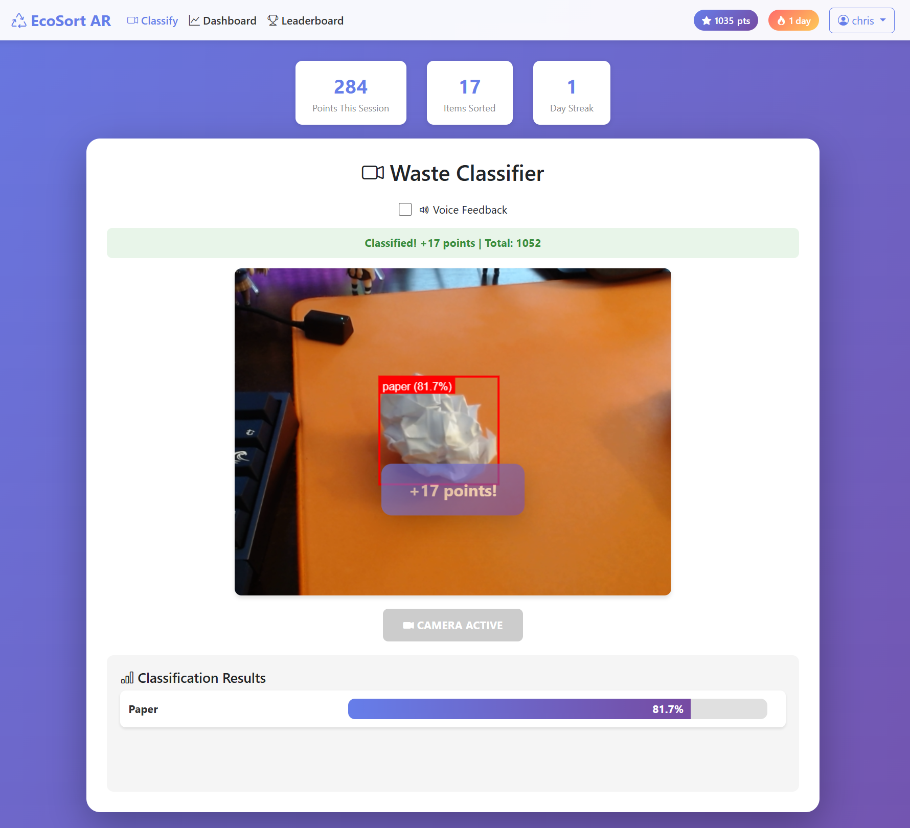
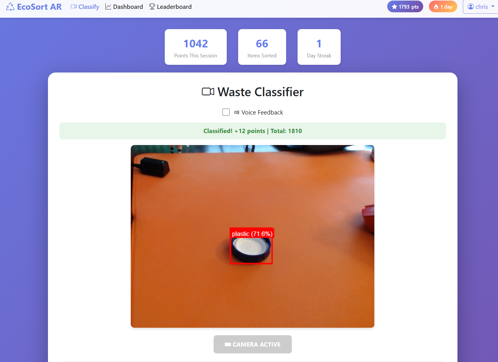

# EcoSortAR

EcoSortAR tackles the issue of recycling contamination, a major problem in North America where only about 25–27% of recyclable waste is properly diverted, resulting in billions of dollars in unnecessary costs—over $20 million in extra expenses for Toronto alone and more than $3.5 billion across the U.S. due to manual sorting, lost material value, and landfilling rejected loads. Our app uses machine learning to identify waste items in real time and leverages augmented reality to show users what type of material they're disposing of, helping them learn proper sorting habits over time.

## Demo





## Features

- **Real-time Classification**: Continuous webcam analysis with bounding box overlays
- **ML-Powered**: Roboflow API integration with fallback to local YOLO model
- **Gamification System**:
  - Points for each classification (bonus for recyclables)
  - Daily streaks with multipliers
  - 14 unlockable badges
  - Global leaderboard
- **User Accounts**: Registration, login, profile pages
- **Analytics Dashboard**: Track your environmental impact with charts
- **Voice Feedback**: Optional audio announcements for classifications
- **Classification Categories**:
  - Cardboard
  - Glass
  - Metal
  - Paper
  - Plastic
  - Trash

## Prerequisites

- Python 3.8 or higher
- Webcam
- Modern web browser (Chrome, Firefox, Edge, Safari)

## Installation

1. Navigate to the project directory:
```bash
cd flask-webcam-classifier
```

2. Create a virtual environment (recommended):
```bash
python -m venv venv
```

3. Activate the virtual environment:
- Windows:
```bash
venv\Scripts\activate
```
- macOS/Linux:
```bash
source venv/bin/activate
```

4. Install required packages:
```bash
pip install -r requirements.txt
```

5. Set up environment variables:
```bash
cp .env.example .env
```
Edit `.env` and add your Roboflow API key (get one at https://app.roboflow.com/settings/api)

6. Initialize the database:
```bash
python init_db.py
```

## Running the Application

1. Start the Flask server:
```bash
python app.py
```

2. Open your web browser and navigate to:
```
http://localhost:5000
```

3. Register an account or log in

4. Click "Start Camera" to begin classifying

5. Point your camera at waste items - classification happens automatically

## Usage Tips

- Ensure good lighting for better classification results
- Position the object clearly in the center of the camera view
- Try to avoid cluttered backgrounds
- The model works best when the object takes up a significant portion of the frame

## Technologies Used

- **Backend**: Flask, Flask-Login, Flask-SQLAlchemy
- **Database**: SQLite
- **ML/Classification**: Roboflow API, YOLOv8 (fallback)
- **Image Processing**: OpenCV, Pillow, NumPy
- **Frontend**: HTML5, CSS3, JavaScript, Bootstrap 5, Chart.js
- **Webcam API**: MediaDevices Web API
- **Voice**: Web Speech API

## Troubleshooting

### Camera not working
- Ensure you've granted camera permissions to your browser
- Check if another application is using the camera
- Try refreshing the page or restarting the browser

### Classification not working
- Check that your Roboflow API key is set in `.env`
- Verify your API key at https://app.roboflow.com/settings/api
- If using local model, ensure `my_model.pt` and `labels.txt` exist

### Import errors
- Ensure you're in the virtual environment
- Try reinstalling requirements: `pip install -r requirements.txt --force-reinstall`

### Database errors
- Run `python init_db.py` to initialize/reset the database
